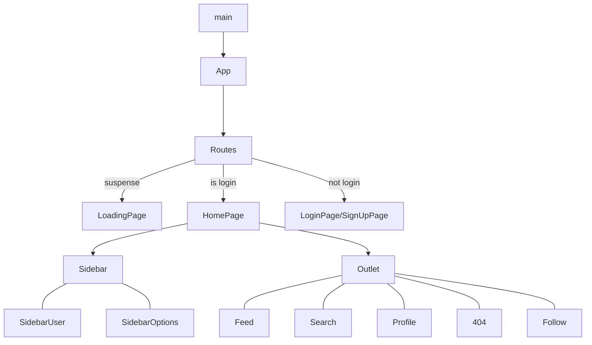

# [Client of a Twitter clone](https://github.com/zhenyuefu/technoweb-twitter)

**Projet de l’UE LU3IN017 TechnoWeb de Sorbonne Universite**

Ce projet implémente un site de réseau social comme twitter basé sur MERN.

Lien pour le [`serveur`](https://github.com/zhenyuefu/technoweb-twitter-server )

Ce site est actuellement host sur vercel: Site de [**demo**](https://twitter.fuzy.tech/) 

### How to run

1. Clone this repo

   ```sh
   git clone https://github.com/zhenyuefu/technoweb-twitter.git
   ```

2. Créer un fichier .env à la racine du projet. Les variables d'environnement suivantes doivent être incluses dans le fichier.

   Vous devez demander un `client id` imgur pour télécharger des images . click [here](https://api.imgur.com/oauth2/addclient)

   ```
   VITE_API_BASE_URL=<api_url_example_http://10.211.55.2:8000>
   VITE_IMGUR_CLIENT_ID=<Client_ID_for_imgur>
   ```

3. Pour mongodb, je recommande d'utiliser [l'atlas](https://www.mongodb.com/atlas/database) en ligne. Si vous utilisez un mongodb local, veuillez vous assurer que votre `mongod instances` est un `ReplicaSet`. See [Deploy a Replica Set for Testing and Development](https://www.mongodb.com/docs/manual/tutorial/deploy-replica-set-for-testing/)

4. run yarn pour installer toutes les dépendances

   ```
   yarn
   ```

5. Maintenant, votre serveur est lance.

   ```
   yarn dev
   ```

### Introduction

##### Architecture du code 

Si votre éditeur n'affiche pas le diagramme ci-dessous, vous pouvez cliquer sur [ce lien](https://github.com/zhenyuefu/technoweb-twitter#architecture-du-code) pour aller sur github et le visualiser en ligne.




##### Modules pour le client

```
"@arco-design/web-react": "^2.32.2", // UI components library
"@icon-park/react": "^1.3.5",        // icons
"b-validate": "^1.4.0",              // validate form
"moment": "^2.29.3",                 // handle date
"react": "^18.1.0",
"react-dom": "^18.1.0",
"react-easy-crop": "^4.2.0",         // crop avatar
"react-router-dom": "^6.3.0",        // routage
"recoil": "^0.7.2",                  // state mangement
"swr": "^1.3.0"                      // fetch data
```

Voici quelques-unes des dépendances de ce projet.

Ce project ne utilise pas `CRA` mais `vite`, qui est super rapid pendant devlopment.

Le choix d'[arco design](https://github.com/arco-design/arco-design) comme UI components library m'a permis de construire une interface utilisateur plus soignée.

##### Features

- Inscription et connexion de l'utilisateur
- Routage avec `react-router`
- Saut automatique en fonction du statut de connexion, possibilité de sauvegarder le statut de connexion
- Publier des posts contenant des images, poster des commentaires, like post
- Follow/Unfollow 
- Télécharger une photo de profil, avatar, introduction
- Dark Mode

##### TODO

- [ ] delete post

- [ ] retweet

- [ ] message private
- [ ] notification
- [ ] …